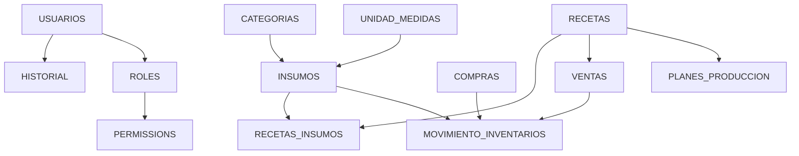

# 🗄️ DOCUMENTACIÓN COMPLETA DE LA BASE DE DATOS

## Sistema de Gestión de Restaurante - TecnoWeb

---

## 📚 ÍNDICE DE DOCUMENTACIÓN

Esta carpeta contiene toda la documentación relacionada con la base de datos del sistema:

### 1. 📄 **SCRIPT_BASE_DATOS_COMPLETA.sql**
   - **Descripción**: Script SQL completo para crear todas las tablas
   - **Uso**: Ejecutar directamente en MySQL/PostgreSQL
   - **Contenido**: 
     - ✅ Todas las tablas del negocio
     - ✅ Tablas del sistema de permisos
     - ✅ Tablas del sistema Laravel
     - ✅ Llaves foráneas y restricciones
   - **Cuándo usar**: Cuando quieres crear la BD sin Laravel

### 2. 📊 **DIAGRAMA_BASE_DATOS.md**
   - **Descripción**: Documentación detallada de cada tabla
   - **Contenido**:
     - 📋 Descripción de cada tabla
     - 🔗 Diagrama de relaciones en texto
     - 🎯 Flujo de operaciones principales
     - 📌 Notas importantes
   - **Cuándo usar**: Para entender la estructura completa

### 3. 📖 **INSTRUCCIONES_BASE_DATOS.md**
   - **Descripción**: Guía paso a paso para trabajar con la BD
   - **Contenido**:
     - 🚀 Métodos de creación (Laravel y SQL)
     - ⚙️ Configuración del .env
     - 🔄 Comandos útiles de Laravel
     - 🛠️ Solución de problemas
     - 🔐 Creación de usuarios y roles
     - 📈 Respaldo y restauración
   - **Cuándo usar**: Cuando necesitas configurar o administrar la BD

### 4. 🎨 **DIAGRAMA_ER.puml**
   - **Descripción**: Diagrama Entidad-Relación en formato PlantUML
   - **Uso**: Abrir con PlantUML Viewer o similar
   - **Contenido**:
     - 📐 Diagrama visual de todas las tablas
     - 🔗 Relaciones entre entidades
     - 📝 Notas explicativas
   - **Cuándo usar**: Para ver la estructura visualmente

---

## 🚀 INICIO RÁPIDO

### Si es tu primera vez:

1. **Revisar la estructura**:
   ```bash
   # Lee primero:
   - DIAGRAMA_BASE_DATOS.md (para entender el sistema)
   ```

2. **Configurar Laravel**:
   ```bash
   cd sistema-web
   cp .env.example .env
   # Editar .env con tus datos de conexión
   php artisan key:generate
   ```

3. **Crear la base de datos**:
   ```bash
   # Método Laravel (recomendado)
   php artisan migrate
   php artisan db:seed
   
   # O método SQL directo
   mysql -u root -p < SCRIPT_BASE_DATOS_COMPLETA.sql
   ```

4. **Verificar**:
   ```bash
   php artisan migrate:status
   php artisan db:show
   ```

---

## 📊 RESUMEN DE LA ESTRUCTURA

### Total de tablas: **24 tablas**

#### 🏢 Tablas del Negocio (13):
1. `usuarios` - Usuarios del sistema
2. `unidad_medidas` - Unidades de medida
3. `categorias` - Categorías de insumos
4. `proveedores` - Proveedores
5. `insumos` - Inventario de insumos
6. `recetas` - Recetas/Platillos
7. `recetas_insumos` - Relación recetas-insumos
8. `ventas` - Registro de ventas
9. `compras` - Registro de compras
10. `movimiento_inventarios` - Movimientos de stock
11. `planes_produccion` - Planes de producción
12. `reportes_personalizados` - Configuración de reportes
13. `historial` - Auditoría del sistema

#### 🔐 Sistema de Permisos (5):
14. `permissions` - Permisos del sistema
15. `roles` - Roles de usuario
16. `model_has_permissions` - Permisos por usuario
17. `model_has_roles` - Roles por usuario
18. `role_has_permissions` - Permisos por rol

#### ⚙️ Sistema Laravel (6):
19. `notifications` - Notificaciones
20. `sessions` - Sesiones de usuario
21. `cache` - Sistema de caché
22. `cache_locks` - Bloqueos de caché
23. `jobs` - Cola de trabajos
24. `failed_jobs` - Trabajos fallidos

---

## 🔗 RELACIONES PRINCIPALES



---

## 🎯 CASOS DE USO COMUNES

### 1. Registrar una venta
```sql
-- 1. Insertar venta
INSERT INTO ventas (cantidad, precio, total, receta_id) 
VALUES (2, 50.00, 100.00, 1);

-- 2. Descontar automáticamente del inventario
-- (esto lo hace el sistema mediante MovimientoInventariosService)
```

### 2. Registrar una compra
```sql
-- 1. Insertar compra
INSERT INTO compras (costo_total, proveedor, descripcion) 
VALUES (500.00, 'Proveedor XYZ', 'Compra de insumos varios');

-- 2. Agregar al inventario
-- (se maneja mediante el sistema)
```

### 3. Verificar stock bajo
```sql
-- Ver insumos con stock bajo
SELECT 
    i.nombre,
    SUM(CASE WHEN m.tipo = 'entrada' THEN m.cantidad ELSE -m.cantidad END) as stock_actual,
    i.stock_minimo
FROM insumos i
LEFT JOIN movimiento_inventarios m ON m.insumo_id = i.id
GROUP BY i.id
HAVING stock_actual < i.stock_minimo;
```

### 4. Reporte de ventas del mes
```sql
-- Ventas por receta en el mes actual
SELECT 
    r.nombre,
    COUNT(v.id) as cantidad_ventas,
    SUM(v.total) as total_vendido
FROM ventas v
JOIN recetas r ON v.receta_id = r.id
WHERE MONTH(v.created_at) = MONTH(CURRENT_DATE())
GROUP BY r.id
ORDER BY total_vendido DESC;
```

---

## 🔧 HERRAMIENTAS RECOMENDADAS

### Para visualizar la base de datos:
- **MySQL Workbench** (para MySQL)
- **DBeaver** (multi-plataforma, soporta varios motores)
- **phpMyAdmin** (web-based)
- **TablePlus** (moderno y elegante)
- **HeidiSQL** (ligero y potente)

### Para ver el diagrama PlantUML:
- **VS Code** + extensión PlantUML
- **IntelliJ IDEA** (soporte nativo)
- **PlantUML Online Server**: http://www.plantuml.com/plantuml
- **PlantText**: https://www.planttext.com/

---

## 📱 ACCESO A LA BASE DE DATOS

### Desde Laravel (Eloquent ORM):
```php
// Obtener todos los insumos
$insumos = Insumo::all();

// Obtener una receta con sus insumos
$receta = Receta::with('insumos')->find(1);

// Crear una venta
$venta = Venta::create([
    'cantidad' => 2,
    'precio' => 50.00,
    'total' => 100.00,
    'receta_id' => 1
]);
```

### Desde SQL directo:
```php
// Query Builder
$insumos = DB::table('insumos')->get();

// SQL raw
$results = DB::select('SELECT * FROM insumos WHERE stock_minimo > ?', [10]);
```

### Desde línea de comandos:
```bash
# Conectar a MySQL
mysql -u root -p restaurante_db

# Conectar a PostgreSQL
psql -U postgres -d restaurante_db

# Usar tinker (consola interactiva de Laravel)
php artisan tinker
```

---

## 🔐 SEGURIDAD Y MEJORES PRÁCTICAS

### ✅ Recomendaciones:

1. **Respaldos regulares**:
   ```bash
   # Crear respaldo diario
   mysqldump -u root -p restaurante_db > backup_$(date +%Y%m%d).sql
   ```

2. **Usar transacciones para operaciones críticas**:
   ```php
   DB::transaction(function () {
       // Operaciones que deben ejecutarse juntas
   });
   ```

3. **Validar datos antes de insertar**:
   ```php
   $validated = $request->validate([
       'nombre' => 'required|max:50',
       'email' => 'required|email|unique:users',
   ]);
   ```

4. **No usar `migrate:fresh` en producción**:
   ```bash
   # ❌ NUNCA en producción
   php artisan migrate:fresh
   
   # ✅ Usar solo migrate
   php artisan migrate
   ```

5. **Proteger el archivo .env**:
   - No subirlo a Git
   - Usar permisos restrictivos (chmod 600)
   - Cambiar credenciales regularmente

---

## 📞 SOPORTE Y AYUDA

### Si tienes problemas:

1. **Revisar logs de Laravel**:
   ```bash
   tail -f sistema-web/storage/logs/laravel.log
   ```

2. **Verificar conexión a la BD**:
   ```bash
   php artisan tinker
   >>> DB::connection()->getPdo();
   ```

3. **Ver migraciones pendientes**:
   ```bash
   php artisan migrate:status
   ```

4. **Consultar la documentación**:
   - Laravel: https://laravel.com/docs
   - MySQL: https://dev.mysql.com/doc/

---

## 📝 HISTORIAL DE CAMBIOS

| Fecha | Cambio | Archivo afectado |
|-------|--------|------------------|
| 2025-11-03 | Agregado campo `proveedor` y `descripcion` a compras | `add_fields_to_compras.php` |
| 2025-11-03 | Creación de tabla `reportes_personalizados` | `create_reportes_personalizados_table.php` |
| 2025-11-03 | Creación de tabla `planes_produccion` | `create_planes_produccion_table.php` |
| 2025-07-09 | Agregado campo `precio` a recetas | `add_precio_to_recetas_table.php` |
| 2025-07-09 | Agregado campo `visible` a recetas | `add_visible_to_recetas_table.php` |

---

## 🎓 RECURSOS ADICIONALES

### Tutoriales recomendados:
- [Laravel Database: Getting Started](https://laravel.com/docs/database)
- [Eloquent: Relationships](https://laravel.com/docs/eloquent-relationships)
- [Database: Migrations](https://laravel.com/docs/migrations)

### Comunidad:
- Laravel en Español: https://laraveles.com/
- Stack Overflow: https://stackoverflow.com/questions/tagged/laravel
- Laravel Discord: https://discord.gg/laravel

---

## ✨ CARACTERÍSTICAS DESTACADAS

### 🤖 Integración con IA
El sistema incluye un servicio de IA (`servicio-ia/`) que:
- Predice el consumo de insumos
- Usa datos de `ventas` y `movimiento_inventarios`
- Ayuda a optimizar compras y reducir desperdicios

### 📊 Sistema de Reportes
- Reportes personalizados por rango de fechas
- Análisis de ventas y consumo
- Identificación de productos más rentables

### 🔔 Notificaciones Automáticas
- Alertas cuando el stock está bajo
- Notificaciones de cambios importantes
- Recordatorios de acciones pendientes

### 📜 Auditoría Completa
- Todo cambio queda registrado en `historial`
- Trazabilidad de todas las operaciones
- Identificación de quien hizo qué y cuándo

---

**Última actualización**: Noviembre 3, 2025  
**Versión del sistema**: 1.0  
**Desarrollado para**: Proyecto TecnoWeb - Sistema de Gestión de Restaurante

---

## 🤝 CONTRIBUIR

Si encuentras algún error o tienes sugerencias:
1. Documenta el problema
2. Propón una solución
3. Prueba en ambiente de desarrollo primero
4. Actualiza esta documentación si es necesario

---

**¿Listo para comenzar?** 🚀

1. Lee `DIAGRAMA_BASE_DATOS.md` para entender la estructura
2. Sigue `INSTRUCCIONES_BASE_DATOS.md` para configurar
3. Usa `SCRIPT_BASE_DATOS_COMPLETA.sql` si lo necesitas
4. Visualiza `DIAGRAMA_ER.puml` para ver las relaciones

¡Éxito con tu proyecto! 💪

